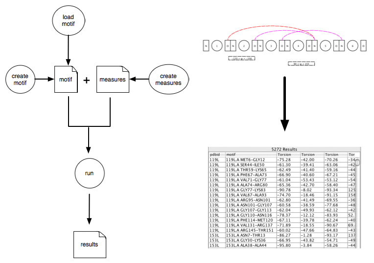
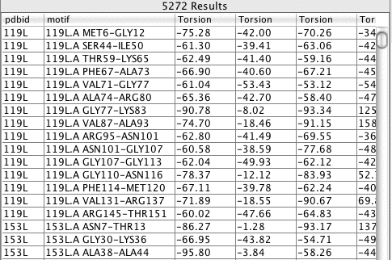

# Quickstart

## Running a search

Tailor allows the user to define a motif, and a list of measures. The search and measurement are done simultaneously, and the result is a list of protein parts and numbers (measurements). This process is shown schematically below, along with a motif and some printed results from a run. 

The third essential input to the run is some data to search on. This is usually going to be pdb files - either stored locally, or from a public data bank. However, it could be data from generated models. 

## Defining a motif

A motif is a description with some conditions attached to it. The search engine will find all structure fragments that match both the description and the conditions. A graphical representation of a motif is shown below.

The conditions are the dashed lines and boxes above and below the central row. Circled numbers represent residues, while the O/N boxes are peptide links. Dashed arcs represent hydrogen bonds and dashed boxes are torsions.

## Interpreting the results

The basic results are a table or list, with a row for each structure fragment found. Each row has the identifier for the structure the fragment came from, a simple indication of where it is in the structure, and the list of measurements. The output - as seen in the java gui - is below. 

The results at the command line are just a table of tab-separated text, which can easily be manipulated with text parsing tools like grep, or opened in a spreadsheet for further analysis.
