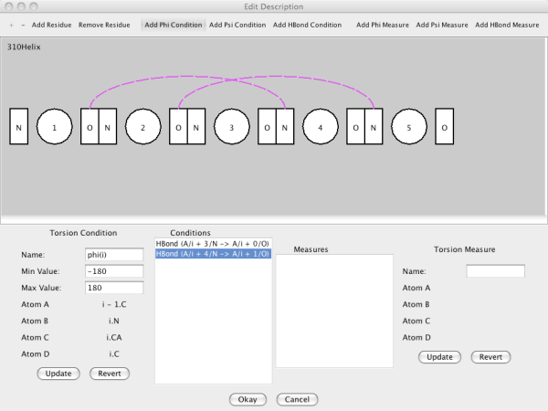
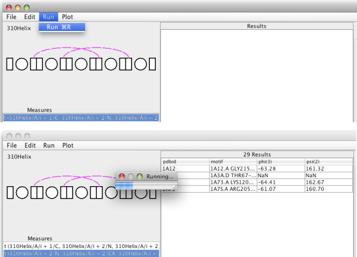
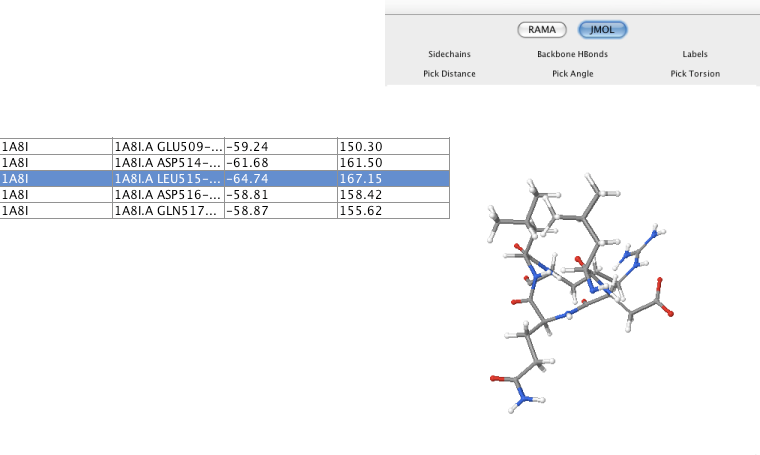

# Getting started
These are some example steps to show how to use the Tailor GUI. Menu commands are formatted like this : *Menu->MenuItem*.

## Setup and startup

- Put tailor.jar into a directory, without unpacking it
- Optionally, make a data subdirectory called "structures", or a softlink to an existing directory of pdb files
- Run by double clicking on tailor.jar or with "tailor.bat" or "tailor.sh" or "java -jar tailor.jar"
- If you want to use JMol, alter the .sh or .bat file to set the path to the JMol.jar

## Step 1 : load or create a description

The first step is to get a description (a motif or pattern). One way is to select the menu option File->Open to open an xml description. Another is to select File->New to create a description from scratch. 

The new description will be displayed as a simplified cartoon in top left. This area starts out labelled as "No Motif Loaded". It will revert to this state if File->Close is selected. 'Close' will also clear the other parts of the frame.

The name of the motif is shown in the upper left of the panel. No other parts are labelled as the font size can get too small to read.

## Step 2 : add measures to the description 

The description can be edited by double clicking on the image or selecting Edit->Edit Description. This brings up the DescriptionEditor.

This is a complex dialog, but for now, just add a measure on phi and psi for the third residue. The circles represent residues (CA atoms), while the N and O are the peptide links. To make a phi measure, click on "Add Phi Measure" at the top right, and click on the third circle. 

## Step 3 : run the description against the sample data

Now that the description has some measures to be made, it can be run against the sample data provided. Select Run->Run or use the command-R shortcut. A progress bar will appear, and the table will start to fill with results.

Each measure produces measurements in a separate column, after the column for the pdbid and the column for the motif details.

## Step 4 : select torsion columns to plot

Now that some results are available, it is possible to do some analysis. Tailor is not intended for complex numerical analysis, but basic plotting is available. With the Ramachandran plot enabled, select two columns that hold torsion data.

 The points are plotted in blue on the Ramachandran plot. Additional pairs of columns will show as other colours, according to the key on the right hand side of the plot.

## (Step 5 : switch to Jmol panel and select row)

NOTE : This is only available if the path to jMol has been set right!

If there is a "Jmol" button next to the "Rama" button, then it is possible to see the fragments found by the search, and to show the measurements made. As with the Ramachandran plot, clicking on the result table will show on the Jmol panel - except that only rows can be selected. 

